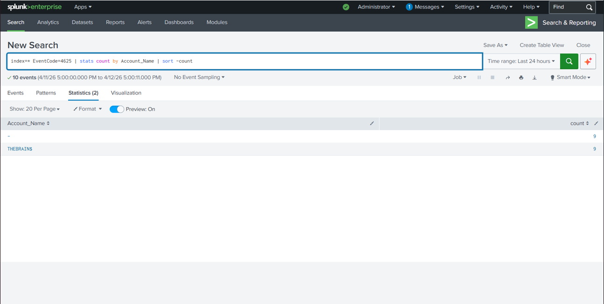
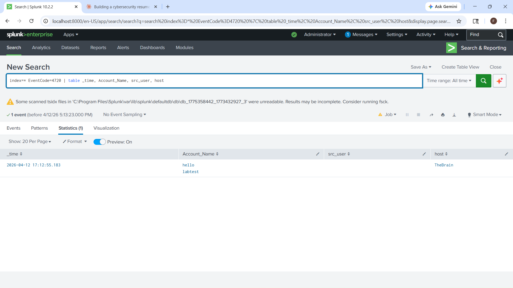
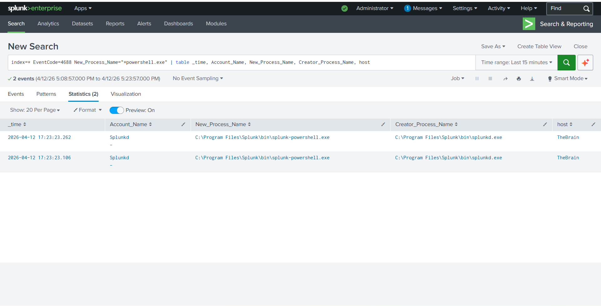

# home-siem-lab-splunk

## Objective
Built a home SIEM envoirnment using Splunk Enterprise to simulate, detect, and investigate common attack techniques against a Windows host.

## Tools Used
- Splunk Enterprise 10.2.2
- Windows Event Logs (Security, System, Application)
- Windows Process Creation Auditing (auditpol)
- SPL (Splunk Process Language)

## Lab Architecture
- Host: TheBrain (Windows local machine)
- SIEM: Splunk Enterprise running at localhost:8000
- Log sources: Windows Security, System, and Application Event Logs

## Detection Rules Built

### 1. Brute Force Login Detection (EventCode 4625)
index=* EventCode=4625 | stats count by Account_Name | sort -count

### 2. Unauthorized User Account Creation (EventCode 4720)
index=* EventCode=4720 | table _time, Account_Name, src_user, host

### 3. PowerShell Execution Detected (EventCode 4688)
index=* EventCode=4688 New_Process_Name="*powershell.exe" | table _time, Account_Name, New_Process_Name, Creator_Process_Name, host

## Attack Simulations & Results

### Brute Force
Simulated 9 consecutive failed logins - Splunk detected account THEBRAINS$ with 9 EventCode 4625 events.

### Unauthorized Account Creation
Created test account 'labtest' via PowerShell - Splunk captured EventCode 4720 with timestamp, creater, and host.

### PowerShell Execution
Enabled process creation auditing and confirmed Splunk captures all PowerShell execution via EventCode 4688.

## Incident Report 
[View Full Incident Report](report/Incident%20report.docx)
## Screenshots

### Brute Force Detection

### New User Account Created

### PowerShell Execution

